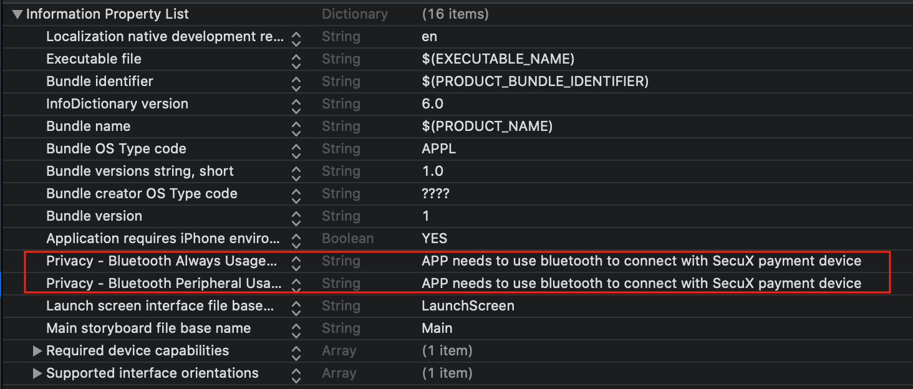

# secux-paymentkit-v2

[](https://travis-ci.org/maochuns/secux-paymentkit-v2)
[](https://cocoapods.org/pods/secux-paymentkit-v2)
[](https://cocoapods.org/pods/secux-paymentkit-v2)
[](https://cocoapods.org/pods/secux-paymentkit-v2)

## Example

To run the example project, clone the repo, and run `pod install` from the Example directory first.

## Requirements

## Installation

secux-paymentkit-v2 is available through [CocoaPods](https://cocoapods.org). To install
it, simply add the following line to your Podfile:

```ruby
pod 'secux-paymentkit-v2'
```

### Add bluetooth privacy permissions in the plist



### Import the module

```swift 
    import secux_paymentkit_v2
```

## Usage

### Server URL
        Set server URL before using the APIs below

#### <u>Declaration</u>
```swift
    func setBaseServer(url:String)
```

#### <u>Parameters</u>
        Server URL. e.g. https://pmsweb-test.secux.io

### SecuXAccount related operations

Use SecuXAccountManager object to do the operations below
```swift
    let accManager = SecuXAccountManager()
```

1. <b>Get supported coin/token</b>

#### <u>Declaration</u>
```swift
    func getSupportedCoinTokenArray() 
            -> (SecuXRequestResult, Data?, [(coin:String, token:String)]?)
```

#### <u>Return value</u>
```
    SecuXRequestResult shows the operation result, if the result is  
    SecuXRequestResult.SecuXRequestOK, the returned array contains all the supported 
    coin and token pairs, otherwise data might contain an error message.  
```

#### <u>Sample</u>
```swift
    let (ret, data, coinTokenArray) = accManager.getSupportedCoinTokenArray()
    guard ret == SecuXRequestResult.SecuXRequestOK else{
        var error = ""
        if let data = data{
            error = String(data: data, encoding: .utf8) ?? ""
        }
        print("Error: \(error)")
        
        return
    }
    
    if let coinTokenArr = coinTokenArray{
        for item in coinTokenArr{
            print("coin=\(item.coin) token=\(item.token)")
        }
    }
```

2. <b>Registration</b>
#### <u>Declaration</u>
```swift
    func registerUserAccount(userAccount: SecuXUserAccount, 
                                coinType: String, 
                                   token: String) -> (SecuXRequestResult, Data?)
```

#### <u>Parameters</u>
```
    userAccount: A SecuXUserAccount object with login name and password  
    coinType:    Coin type string  
    token:       Token string
```

#### <u>Return value</u>
```
    SecuXRequestResult shows the operation result. If the result is SecuXRequestOK,
    registration is successful, otherwise data might contain an error message.
```

#### <u>Sample</u>
```swift
    let usrAcc = SecuXUserAccount(email: name, password: pwd)
    var (ret, data) = accManager.registerUserAccount(userAccount: usrAcc, 
                                                        coinType: "DCT", 
                                                           token: "SPC")
    
    if ret == SecuXRequestResult.SecuXRequestOK{
        //Login the account
        ...
    }else{
        var errorMsg = ""
        if let data = data, let error = String(data: data, encoding: String.Encoding.utf8){
            errorMsg = error
        }
        print("Registration failed! error \(error)")
    }
```

3. <b>Login</b>

Note: **Login session is valid for 30 minutes**. To continue use after 30 minutes, relogin is required.

#### <u>Declaration</u>
```swift
    func loginUserAccount(userAccount:SecuXUserAccount) -> (SecuXRequestResult, Data?)
```
#### <u>Parameter</u>
```
    userAccount: A SecuXUserAccount object with login name and password  
```

#### <u>Return value</u>
```
    SecuXRequestResult shows the operation result. If the result is SecuXRequestOK, 
    login is successful, otherwise data might contain an error message.
```

#### <u>Sample</u>
```swift
    let accManager = SecuXAccountManager()
    let usrAcc = SecuXUserAccount(email: name, password: pwd)
    
    var (ret, data) = accManager.loginUserAccount(userAccount: usrAcc)
    if ret == SecuXRequestResult.SecuXRequestOK{
        
        //Login successfully
        ...
        
    }else{
        var errorMsg = "Invalid email/password!"
        if let data = data, let error = String(data: data, encoding: String.Encoding.utf8){
            errorMsg = error
        }
        print("Login failed! error \(error)")
    }
```

4. <b>Get coin/token account list</b>  
Must successfully login the server before calling the function

#### <u>Declaration</u>
```swift
    func getCoinAccountList(userAccount:SecuXUserAccount) -> (SecuXRequestResult, Data?)
```
#### <u>Parameter</u>
```
    userAccount: Successfully logined user account.
```

#### <u>Return value</u>
```
    SecuXRequestResult shows the operation result. If the result is SecuXRequestOK, 
    getting coin/token account information is successful and coin/token account 
    information is in the user account's coinAccountArray, otherwise data might contain  
    an error message.

    Note: if return result is SecuXRequestNoToken / SecuXRequestUnauthorized, the login 
    session is timeout, please relogin the system.
```

#### <u>Sample</u>
```swift
    let (ret, data) = accManager.getCoinAccountList(userAccount: usrAcc)
    if ret == SecuXRequestResult.SecuXRequestOK{    
        for coinAcc in usrAcc.coinAccountArray{
            let tokenArr = coinAcc.tokenBalanceDict.keys
            for token in tokenArr{
                print("coin/token account: \(coinAcc.coinType) \(token)")
            }
        }
    }else{
        var errorMsg = ""
        if let data = data, let error = String(data: data, encoding: String.Encoding.utf8){
            errorMsg = error
        }
        print("Get coin/token info. failed! error \(error)")
    }
```

5. <b>Get coin/token account balance</b> 

#### <u>Declaration</u>
```swift
    func getAccountBalance(userAccount:SecuXUserAccount, 
                              coinType: String? = nil, 
                                 token: String? = nil) -> (SecuXRequestResult, Data?)
```
#### <u>Parameter</u>
```
    userAccount: A SecuXUserAccount object with login name and password  
    coinType:    CoinType string  
    token:       Token string
```

#### <u>Return value</u>
```
    SecuXRequestResult shows the operation result. If the result is SecuXRequestOK, 
    getting coin/token account balance is successful and coin/token account balance can 
    be found in the user account's coinAccountArray, otherwise data might contain 
    an error message.

    Note: if return result is SecuXRequestNoToken / SecuXRequestUnauthorized, the login 
    session is timeout, please relogin the system.
```

#### <u>Sample</u>
```swift
    let (ret, data) = accManager.getAccountBalance(userAccount: usrAcc, 
                                                   coinType: "DCT", token: "SPC")
                
    guard ret == SecuXRequestResult.SecuXRequestOK else{
        print("get \(coinAcc.coinType) \(token) balance failed")
        if let data = data{
            print("Error: \(String(data: data, encoding: String.Encoding.utf8) ?? "")")
        }
        continue
    }
    
    let coinAcc = usrAcc.getCoinAccount(coinType: "DCT")
    if let tokenBal = coinAcc.tokenBalanceDict["SPC"]{
        print("\(coinAcc.coinType) \(token) \(tokenBal.theBalance) 
               \(tokenBal.theFormattedBalance) \(tokenBal.theUsdBalance)")
    }
```

### SecuXPayment related operations

Use SecuXPaymentManager object to do the operations below

```swift
    let paymentManager = SecuXPaymentManager()
```

1. <b>Parsing payment QRCode / NFC message</b>
#### <u>Declaration</u>
```swift
    func getPaymentInfo(paymentInfo: String)->(SecuXRequestResult, Data?)
```
#### <u>Parameter</u>
```
    paymentInfo: Payment QRCode from P20/P22, or NFC string from P20/P22
```
#### <u>Return value</u>
```
    SecuXRequestResult shows the operation result. If the result is SecuXRequestOK, 
    parsing payment information is successful and data contains decoded payment 
    information in JSON format , otherwise data might contain an error message.

    Note: if return result is SecuXRequestNoToken / SecuXRequestUnauthorized, the login 
    session is timeout, please relogin the system.


    Sample return JSON format
    {
        "amount": "10",
        "coinType": "DCT:SPC",
        "deviceID": "4ab10000726b",
        "deviceIDhash": "41193D32D520E114A3730D458F4389B5B9A7114D"
    }
    
    Note: "amount" and "coinType" are optional, QRCode from P20 will not generate 
    these items.
```
#### <u>Sample</u>
```swift
    let (ret, data) = paymentManager.getPaymentInfo(paymentInfo: paymentInfo)
    if ret == SecuXRequestResult.SecuXRequestOK, let data = data{
        print("get payment info. done")
        guard let responseJson = try? JSONSerialization.jsonObject(with: data, options: []) as? [String:Any] else{
            print("Invalid json response from server")
            return
        }
        
        guard let devIDHash = responseJson["deviceIDhash"] as? String else{
            print("Response has no hashed devID")
            return
        }

        var amount = "0"
        if let amountinfo = payinfoJson["amount"] as? String, amountinfo != "null"{
            amount = amountinfo
        }
        
        var cointype = ""
        var token = ""
        if let type = payinfoJson["coinType"] as? String, type != "null"{
            
            if let pos = type.firstIndex(of: ":"){
                cointype = String(type[..<pos])
                token = String(type[type.index(after: pos)...])
            }
        }       
    }
```

2. <b>Get store information</b>
#### <u>Declaration</u>
```swift
    func getStoreInfo(devID:String) -> (SecuXRequestResult, String, UIImage?, 
                                        [(coin:String, token:String)]?)
```
#### <u>Parameter</u>
```
    devID: Hashed device ID from getPaymentInfo function
```
#### <u>Return value</u>
```
    SecuXRequestResult shows the operation result. If the result is SecuXRequestOK, 
    getting store information is successful, otherwise data might contain an error message.

    Note: if return result is SecuXRequestNoToken / SecuXRequestUnauthorized, the login 
    session is timeout, please relogin the system.

    For eample:
    let (reqRet, storeInfo, img, supportedCoinTokenArray) 
                        = paymentManager.getStoreInfo(devID: devIDHash)

    reqRet:     SecuXRequestResult
    storeInfo:  Store information in JSON format
    img:        Store logo in UIImage
    supportedCoinTokenArray: Coin/token(s) accepted by the store

    Sample storeInfo json format:
    {
        "storeCode": "568a88ed64b5426eb747f7db00763494",
        "name": "SecuX Cafe",
        "deviceId": "4ab10000726b",
        "icon": ".....",
        "scanTimeout": 10,
        "checkRSSI": -80,
        "connectionTimeout": 30,
        "supportedSymbol": [
            [
            "DCT",
            "SPC"
            ]
        ]
    }

```
#### <u>Sample</u>
```swift
    let (reqRet, storeInfo, img, supportedCoinTokenArray) = paymentManager.getStoreInfo(devID: devIDHash)
    guard reqRet == SecuXRequestResult.SecuXRequestOK, storeInfo.count > 0, 
        let imgStore = img,
        let storeData = storeInfo.data(using: String.Encoding.utf8),
        let coinTokenArray = supportedCoinTokenArray, coinTokenArray.count > 0,
        let storeInfoJson = try? JSONSerialization.jsonObject(with: storeData, options: []) as? [String:Any],
        let storeName = storeInfoJson["name"] as? String,
        let deviceID = storeInfoJson["deviceId"] as? String else{
            self.showMessageInMainThread(title: "Get store information from server failed!", message: "")
            return
    }
```

3. <b>Do payment</b>
#### <u>Declaration</u>
```swift
    func doPaymentAsync(storeInfo: String, paymentInfo: String)
```
#### <u>Parameter</u>
```
    storeInfo:   Store information JSON string from getStoreInfo function
    paymentInfo: Payment information JSON string. 

    Sample paymentInfo json format:

    {
        "amount" : "12",
        "deviceID" : "ffff619c6d40",   
        "token" : "SPC",
        "coinType" : "DCT"
    }

    Note: deviceID is from storeInfo json, e.g.
    let deviceID = storeInfoJson["deviceId"] as? String
```
#### <u>Delegate</u>
```swift
    protocol SecuXPaymentManagerDelegate{
        func paymentDone(ret: Bool, transactionCode:String, errorMsg: String)
        func updatePaymentStatus(status: String)
    }
```
```
    paymentDone: Called when payment is completed. 
                 Returns payment result and an error message.

    updatePaymentStatus: Called when payment status is changed. 
                         Payment status are: 
                         "Device connecting...", 
                         "DCT transferring..."  
                         "Device verifying..."

    Note: You must implement the SecuXPaymentManagerDelegate and set it to the 
    SecuXPayment delegate, e.g. self.paymentManager.delegate = self
```
#### <u>Sample</u>

```swift
class ViewController: UIViewController {

    ...

    func doPayment(){

        ...

        var payinfoDict = [String : String]()
        payinfoDict["amount"] = "12"
        payinfoDict["coinType"] = "DCT"
        payinfoDict["token"] = "SPC"
        payinfoDict["deviceID"] = deviceID
        
        guard let jsonData = try? JSONSerialization.data(withJSONObject: payinfoDict, options: []),
            let paymentInfo = String(data: jsonData, encoding: String.Encoding.utf8) else{
                self.showMessage(title: "Invalid payment information", message: "Payment abort!")
                return
        }

        paymentManager.doPaymentAsync(storeInfo: self.storeInfo, 
                                    paymentInfo: paymentInfo)
    }
}

extension ViewController: SecuXPaymentManagerDelegate{
    
    func paymentDone(ret: Bool, transactionCode: String, errorMsg: String) {
        print("paymentDone \(ret) \(transactionCode) \(errorMsg)")
        
        if ret{
            
            showMessage(title: "Payment success!", message: "")
            let (ret, payhis) = self.paymentManager.getPaymentHistory(token:"SPC", transactionCode: transactionCode)
            if ret == SecuXRequestResult.SecuXRequestOK, let his = payhis{
                print("payment detail: \(his.amount) \(his.storeName) \(his.storeID) \(his.storeTel) \(his.storeAddress)")
            }
        }else{
            showMessage(title: "Payment fail!", message:errorMsg)
        }
    }
    
    func updatePaymentStatus(status: String) {
        print("updatePaymentStatus \(status)")
    }
}
```


4. <b>Get all payment history</b>
#### <u>Declaration</u>
```swift
    func getPaymentHistory(token:String, pageIdx:Int, pageItemCount: Int)
                                        ->(SecuXRequestResult, [SecuXPaymentHistory])  
```
#### <u>Parameter</u>
```
    token:          Payment token, can be empty
    pageIdx:        History item page index starts from 0, e.g. 0,1,2,3...
    pageItemCount:  Number of history items request, e.g. 5, 10, 20 ... 
```

#### <u>Return value</u>
```
    SecuXRequestResult shows the operation result. If the result is SecuXRequestOK, 
    SecuXPaymentHistory objects are in the returned array. If number of the history 
    objects in the return array less than the input pageItemCount, there is no 
    more history items. 

    Note: if return result is SecuXRequestNoToken / SecuXRequestUnauthorized, the login 
    session is timeout, please relogin the system.
```
#### <u>Sample</u>
```swift
    var pageIdx = 0
    let pageItemCount = 20

    while (true){
        let (ret, payHisArr) = paymentManager.getPaymentHistory(token: "", 
                                                            pageIdx: pageIdx, 
                                                            pageItemCount: pageItemCount)
        if ret != SecuXRequestResult.SecuXRequestOK{
            print("get payment history failed \(ret)")
            return
        }
        
        var idx = 0
        for payHis in payHisArr{
            print("\(idx) \(payHis.coinType) \(payHis.token) \(payHis.transactionTime) 
                   \(payHis.amount) \(payHis.detailsUrl)")
            idx += 1
        }
        
        if payHisArr.count < pageItemCount{
            break
        }
        
        pageIdx += 1
    }
```

5. <b>Get payment history from transaction code</b>
#### <u>Declaration</u>
```swift
    func getPaymentHistory(token:String, transactionCode:String)
                                    ->(SecuXRequestResult, SecuXPaymentHistory?)
```
#### <u>Parameter</u>
```
    token:           Payment token, e.g. SPC, DCT
    transactionCode: Payment transaction code from SecuXPaymentManagerDelegate when 
                     payment done
```
#### <u>Return value</u>
```
    SecuXRequestResult shows the operation result. If the result is SecuXRequestOK, 
    payment history is in the returned SecuXPaymentHistory object.

    Note: if return result is SecuXRequestNoToken / SecuXRequestUnauthorized, the login 
    session is timeout, please relogin the system.
```
#### <u>Sample</u>
```swift
    let (ret, payhis) = self.paymentManager.getPaymentHistory(token:"SPC", 
                                                    transactionCode: transactionCode)
    if ret == SecuXRequestResult.SecuXRequestOK, let his = payhis{
        print("payment detail: \(his.amount) \(his.storeName) \(his.storeID) 
                               \(his.storeTel) \(his.storeAddress)")
    }
```

## Author

maochuns, maochunsun@secuxtech.com

## License

secux-paymentkit is available under the MIT license. See the LICENSE file for more info.

